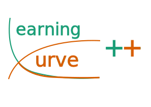

# lcpp [LearningCurvePlusPlus]



**C++ Header-Only Learning Curve Generation Tool**  

Generate learning curves for supervised machine learning algorithms with just header files — no separate compilation needed!  

`lcpp` is designed to help you easily generate learning curves for supervised ML algorithms.  
It provides a clean C++ header-only implementation, making it easy to integrate into your own projects without heavy build setup.  

---

 
## Quick Start  

Use the pre-built image:
```bash
singularity pull lcpp.sif docker://taylanot/lcpp
```

Include **lcpp** in your program by adding the following at the top of your source file:
```cpp
#include <lcpp.h>
```

You can build your project using the provided sample Makefile or your own. The sample Makefile will create a build directory and place your executable there:
```bash
singularity run lcpp.sif make your_project
```

Now, you are ready to run you program...
```bash
build/your_project
```

You can also use the dockerfile to build your own image with docker or podman. Just run to build the image:
```bash
podman build -t lcpp .
```

After, creating your project you can compile your program:
```bash
podman run --rm -v "$(pwd)":/workspace -w /workspace lcpp make your_project
```
then, run it:
```bash
podman run --rm -v "$(pwd)":/workspace -w /workspace lcpp ./build/your_project
```

### Slow Start

On Ubuntu 25 or later you can just use `apt install libmlpack-dev` and `apt install libcurl4-openssl-dev` to install all the dependencies. After cloning this repository and runing `./install.sh`, lcpp is at your disposal.

Note: For previous versions of Ubuntu `libmlpack-dev` is not on the required version, hence you might need to follow the installation guides of [mlpack](https://github.com/mlpack/mlpack/tree/master).

---

## Detailed Documentations

[examples](docs/examples.md)
---
[src](docs/src.md)
---
[algo](docs/algo.md)
---
[data](docs/data.md)
---
[utils](docs/utils.md)
---


## Contributions

Any contributions are welcome. Please make sure you test what your contributions in the related test files.

- Feature Curves generation is on the roadmap of this project.
- New learning algorithms are always welcome.
- New sampling strategies can be useful.

## Dependencies

- [C++20>= ](https://en.cppreference.com/w/cpp/20.html)
- [mlpack 4.4.0>=](https://github.com/mlpack/mlpack/tree/master)  
- [libcurl 7.81.0>=](https://curl.se/libcurl/)

> ** These libraries may have their own dependencies. Make sure they are properly installed before use.** 

## Project History and Development

This work has been developed since 2023 and was previously used in [Turan et al. (2025)](#turan2025) under the name *mlcxx*. The name has since changed from *mlcxx* to *lcpp*. While the majority of the code remains the same, improvements in usability have been made, and unused parts of the code have been removed. It has most recently been used in [Turan et al. (2026)](#turan2026).

### Reference
<a id="turan2025"></a>  
Turan, O. T., Tax, D. M. J., Viering, T. J., & Loog, M. (2025). *Learning learning curves*. Pattern Analysis and Applications, 28, 15. [https://doi.org/10.1007/s10044-024-01394-6](https://doi.org/10.1007/s10044-024-01394-6)

<a id="turan2026"></a>
Turan, O. T., Loog, M., & Tax, D. M. J. (2026). *Generalization Performance Distributions Along Learning Curves*. Pattern Recognition Letters. [https://doi.org/10.1016/j.patrec.2026.01.003](https://doi.org/10.1016/j.patrec.2026.01.003)


